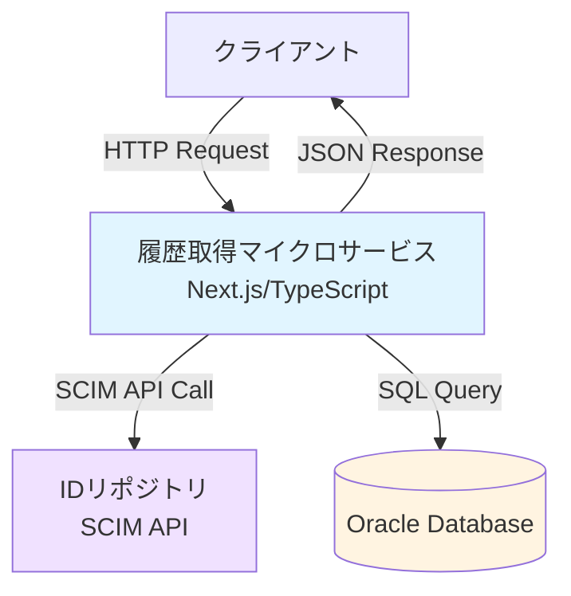
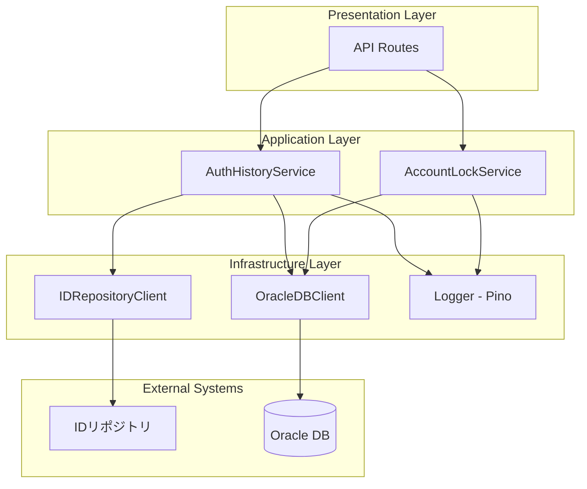
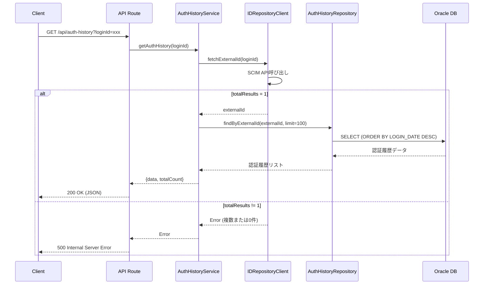
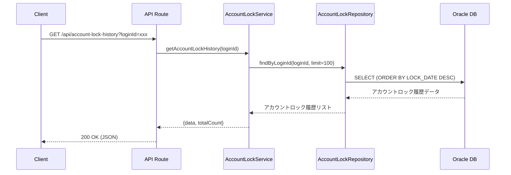
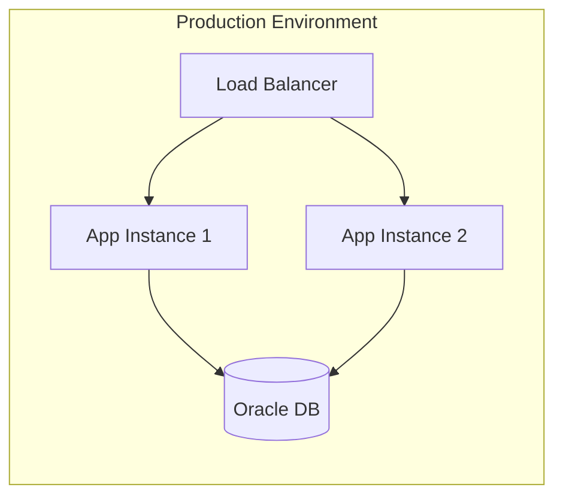
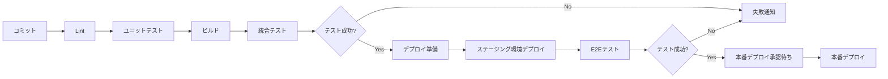

# 基本設計書：履歴取得マイクロサービス

## 1. システム概要

### 1.1 システムの目的と概要

履歴取得マイクロサービスは、認証履歴とアカウントロック履歴を提供するマイクロサービスです。ローカルネットワーク内での利用を前提としており、既存のOracleデータベースから履歴情報を取得し、JSON形式でクライアントに返却します。

### 1.2 システム構成図



### 1.3 技術スタックの詳細

| 項目 | 技術 | バージョン | 用途 |
|------|------|------------|------|
| 言語 | TypeScript | 最新安定版 | アプリケーション開発 |
| フレームワーク | Next.js | 最新安定版 | Webフレームワーク |
| ランタイム | Node.js | LTS | 実行環境 |
| データベース | Oracle | 既存環境 | データ永続化 |
| ORMライブラリ | oracledb | 最新安定版 | Oracle接続 |
| ロギング | pino | 最新安定版 | ログ出力 |
| HTTPクライアント | axios | 最新安定版 | IDリポジトリAPI呼び出し |

---

## 2. アーキテクチャ設計

### 2.1 システムアーキテクチャ図



### 2.2 コンポーネント構成

```
src/
├── app/
│   └── api/
│       ├── auth-history/
│       │   └── route.ts              # 認証履歴返却API
│       └── account-lock-history/
│           └── route.ts              # アカウントロック履歴返却API
├── services/
│   ├── authHistoryService.ts         # 認証履歴ビジネスロジック
│   └── accountLockService.ts         # アカウントロックビジネスロジック
├── repositories/
│   ├── authHistoryRepository.ts      # 認証履歴データアクセス
│   └── accountLockRepository.ts      # アカウントロックデータアクセス
├── clients/
│   ├── idRepositoryClient.ts         # IDリポジトリAPI呼び出し
│   └── oracleClient.ts               # Oracle接続管理
├── models/
│   ├── authHistory.ts                # 認証履歴モデル
│   ├── accountLock.ts                # アカウントロックモデル
│   └── idRepository.ts               # IDリポジトリレスポンスモデル
├── utils/
│   ├── logger.ts                     # ロガー設定
│   ├── errorHandler.ts               # エラーハンドリング
│   └── config.ts                     # 設定管理
└── types/
    └── index.ts                      # 型定義
```

### 2.3 データフロー図

#### 認証履歴返却APIのデータフロー



#### アカウントロック履歴返却APIのデータフロー



---

## 3. API設計

### 3.1 認証履歴返却API

#### エンドポイント
```
GET /api/auth-history
```

#### リクエスト

**クエリパラメータ**
| パラメータ名 | 型 | 必須 | 説明 |
|--------------|-----|------|------|
| loginId | string | ○ | ログインID |

**リクエスト例**
```http
GET /api/auth-history?loginId=user001 HTTP/1.1
Host: localhost:3000
Accept: application/json
```

#### レスポンス

**成功時（200 OK）**
```json
{
  "success": true,
  "data": [
    {
      "loginDate": "2025-10-01T12:34:56.789Z",
      "ipAddress": "192.168.1.100",
      "serviceName": "WebPortal"
    },
    {
      "loginDate": "2025-10-01T10:15:30.123Z",
      "ipAddress": "192.168.1.101",
      "serviceName": "MobileApp"
    }
  ],
  "totalCount": 150,
  "returnedCount": 100
}
```

**エラー時（400 Bad Request）**
```json
{
  "success": false,
  "error": {
    "code": "INVALID_PARAMETER",
    "message": "loginIdは必須です"
  }
}
```

**エラー時（500 Internal Server Error）**
```json
{
  "success": false,
  "error": {
    "code": "MULTIPLE_USERS_FOUND",
    "message": "IDリポジトリから複数のユーザ情報が返却されました"
  }
}
```

#### レスポンスフィールド

| フィールド | 型 | 説明 |
|-----------|-----|------|
| success | boolean | 処理成功フラグ |
| data | array | 認証履歴の配列（最大100件） |
| data[].loginDate | string | 認証日時（ISO8601形式） |
| data[].ipAddress | string | IPアドレス |
| data[].serviceName | string | 認証元サービス名 |
| totalCount | number | 総件数 |
| returnedCount | number | 返却件数 |

### 3.2 アカウントロック履歴返却API

#### エンドポイント
```
GET /api/account-lock-history
```

#### リクエスト

**クエリパラメータ**
| パラメータ名 | 型 | 必須 | 説明 |
|--------------|-----|------|------|
| loginId | string | ○ | ログインID |

**リクエスト例**
```http
GET /api/account-lock-history?loginId=user001 HTTP/1.1
Host: localhost:3000
Accept: application/json
```

#### レスポンス

**成功時（200 OK）**
```json
{
  "success": true,
  "data": [
    {
      "lockDate": "2025-09-30T08:45:12.000Z",
      "ipAddress": "192.168.1.100"
    },
    {
      "lockDate": "2025-09-15T14:20:33.000Z",
      "ipAddress": "192.168.1.105"
    }
  ],
  "totalCount": 50,
  "returnedCount": 50
}
```

**エラー時（400 Bad Request）**
```json
{
  "success": false,
  "error": {
    "code": "INVALID_PARAMETER",
    "message": "loginIdは必須です"
  }
}
```

#### レスポンスフィールド

| フィールド | 型 | 説明 |
|-----------|-----|------|
| success | boolean | 処理成功フラグ |
| data | array | アカウントロック履歴の配列（最大100件） |
| data[].lockDate | string | アカウントロック日時（ISO8601形式） |
| data[].ipAddress | string | IPアドレス |
| totalCount | number | 総件数 |
| returnedCount | number | 返却件数 |

### 3.3 エラーハンドリング

#### エラーコード一覧

| HTTPステータス | エラーコード | 説明 | 対処方法 |
|---------------|-------------|------|----------|
| 400 | INVALID_PARAMETER | 必須パラメータ不足 | リクエストパラメータを確認 |
| 500 | MULTIPLE_USERS_FOUND | IDリポジトリから複数ユーザ返却 | データ整合性を確認 |
| 500 | ID_REPOSITORY_ERROR | IDリポジトリAPI呼び出しエラー | IDリポジトリの状態確認 |
| 500 | DATABASE_ERROR | データベースエラー | DB接続とクエリを確認 |
| 500 | INTERNAL_SERVER_ERROR | その他の内部エラー | ログを確認して原因調査 |

### 3.4 認証・認可方式

ローカルネットワークからの利用のため、認証・認可は実装しません。

---

## 4. データベース設計

### 4.1 テーブル設計詳細

#### AUTH_HISTORY（認証履歴テーブル）

**テーブル定義**
| カラム名 | 型 | NULL | キー | 説明 |
|---------|-----|------|------|------|
| EXTERNAL_ID | VARCHAR2(64) | NOT NULL | PK | 外部ID |
| IP_ADDRESS | VARCHAR2(64) | NOT NULL | - | IPアドレス |
| SERVICE_NAME | VARCHAR2(64) | NOT NULL | - | 認証元サービス名 |
| LOGIN_DATE | TIMESTAMP(4) | NOT NULL | PK | ログイン日時 |
| REG_DATE | DATE | NOT NULL | - | 登録日 |
| REG_NAME | VARCHAR2(64) | NOT NULL | - | 登録者名 |
| ERASE_FLG | VARCHAR2(1) | NOT NULL | - | 削除フラグ（0:有効, 1:削除） |

**制約**
- 主キー: (EXTERNAL_ID, LOGIN_DATE)
- CHECK制約: ERASE_FLG IN ('0', '1')

#### ACCOUNT_LOCK（アカウントロックテーブル）

**テーブル定義**
| カラム名 | 型 | NULL | キー | 説明 |
|---------|-----|------|------|------|
| LOGIN_ID | VARCHAR2(64) | NOT NULL | PK | ログインID |
| IP_ADDRESS | VARCHAR2(15) | NOT NULL | - | IPアドレス |
| LOCK_DATE | DATE | NOT NULL | PK | ロック日時 |
| LOCK_FLG | VARCHAR2(1) | NOT NULL | - | ロックフラグ（0:解除, 1:ロック） |
| REG_DATE | DATE | NOT NULL | - | 登録日 |
| REG_NAME | VARCHAR2(64) | NOT NULL | - | 登録者名 |
| ERASE_FLG | VARCHAR2(1) | NOT NULL | - | 削除フラグ（0:有効, 1:削除） |

**制約**
- 主キー: (LOGIN_ID, LOCK_DATE)
- CHECK制約: LOCK_FLG IN ('0', '1')
- CHECK制約: ERASE_FLG IN ('0', '1')

### 4.2 インデックス設計

#### AUTH_HISTORYテーブル

既存の主キーインデックスに加え、以下のインデックスを推奨：

**インデックス名**: IDX_AUTH_HISTORY_EXTERNAL_ID_DATE  
**対象カラム**: (EXTERNAL_ID, LOGIN_DATE DESC, ERASE_FLG)

**目的**: 
- EXTERNAL_IDでフィルタリング
- LOGIN_DATEの降順ソートを高速化
- ERASE_FLGでの絞り込みを効率化

#### ACCOUNT_LOCKテーブル

既存の主キーインデックスに加え、以下のインデックスを推奨：

**インデックス名**: IDX_ACCOUNT_LOCK_LOGIN_ID_DATE  
**対象カラム**: (LOGIN_ID, LOCK_DATE DESC, ERASE_FLG)

**目的**:
- LOGIN_IDでフィルタリング
- LOCK_DATEの降順ソートを高速化
- ERASE_FLGでの絞り込みを効率化

### 4.3 データアクセスパターン

#### 認証履歴取得処理

**取得条件**:
- EXTERNAL_IDで検索
- ERASE_FLG = '0'のデータのみ
- LOGIN_DATEの降順でソート
- 最大100件を取得

**総件数取得**:
- 同じ条件でCOUNT(*)を実行
- ページング情報として返却

#### アカウントロック履歴取得処理

**取得条件**:
- LOGIN_IDで検索
- ERASE_FLG = '0'のデータのみ
- LOCK_DATEの降順でソート
- 最大100件を取得

**総件数取得**:
- 同じ条件でCOUNT(*)を実行
- ページング情報として返却

### 4.4 パフォーマンス考慮事項

#### コネクションプール設計

**パラメータ**:
- 最小接続数: 2
- 最大接続数: 10
- 接続増分: 2
- プールタイムアウト: 60秒
- キュータイムアウト: 60秒

#### クエリ最適化方針

1. **削除フラグによるフィルタリング**: ERASE_FLG = '0'で有効データのみ取得
2. **件数制限**: データベースレベルでFETCH FIRST 100 ROWS ONLYを使用
3. **インデックスの活用**: WHERE句とORDER BY句のカラムにインデックスを設定
4. **クエリ分離**: 総件数取得と詳細データ取得を分離（必要に応じて）
5. **バインド変数の使用**: SQLインジェクション対策とパフォーマンス向上

#### パフォーマンス目標

- API応答時間: 95パーセンタイルで500ms以内
- データベースクエリ実行時間: 100ms以内
- 同時接続数: 最大100接続

---

## 5. セキュリティ設計

### 5.1 セキュリティ要件の実装方法

#### 5.1.1 ネットワークセキュリティ

ローカルネットワークからの利用のため、以下の前提条件：
- 外部ネットワークからのアクセスは不可
- ファイアウォールによる保護
- ネットワークセグメントの分離

#### 5.1.2 SQLインジェクション対策

**実装方針**:
- パラメータバインディングを必ず使用
- ユーザー入力を直接SQLに埋め込まない
- プリペアドステートメントの活用

#### 5.1.3 入力検証

**ログインIDの検証ルール**:
- 必須チェック
- 型チェック（文字列）
- 文字種チェック（英数字、ハイフン、アンダースコアのみ許可）
- 長さチェック（最大64文字）
- パターンマッチング

### 5.2 データ保護方針

#### 5.2.1 機密情報の取り扱い

**データベース接続情報**:
- 環境変数で管理
- `.env`ファイルは`.gitignore`に含める
- 本番環境では環境変数またはシークレット管理サービスを使用

**機密情報のハードコード禁止**:
- パスワード
- 接続文字列
- APIキー

#### 5.2.2 ログ出力における個人情報保護

**個人情報のマスキング**:
- ログインIDは部分マスキング（例: "us***1"）
- IPアドレスは最終オクテットをマスキング（必要に応じて）
- 完全な個人情報はログに出力しない

**ログ出力レベル**:
- ERROR: エラー、例外のみ
- WARN: 警告事象（複数ユーザ検出など）
- INFO: API呼び出し、主要処理の開始/終了
- DEBUG: デバッグ情報（開発環境のみ）

### 5.3 アクセス制御

#### アプリケーションレベル

ローカルネットワークからの利用のため、アプリケーションレベルでの認証・認可は実装しませんが、以下を考慮：

**データベースアクセス制御**:
- 専用のデータベースユーザを作成
- 読み取り専用権限（SELECT）のみ付与
- 必要最小限のテーブルへのアクセス権限

**インフラストラクチャレベル**:
- IPアドレスレベルでの制限
- レートリミット（将来的に必要に応じて実装）

---

## 6. 非機能要件

### 6.1 パフォーマンス要件

| 項目 | 目標値 | 測定方法 |
|------|--------|----------|
| API応答時間（平均） | 300ms以内 | APM監視ツール |
| API応答時間（95パーセンタイル） | 500ms以内 | APM監視ツール |
| API応答時間（99パーセンタイル） | 1000ms以内 | APM監視ツール |
| スループット | 100 req/sec | 負荷テスト |
| データベース接続プール | 最大10接続 | アプリケーション設定 |

### 6.2 可用性要件

| 項目 | 目標値 | 備考 |
|------|--------|------|
| 稼働率 | 99.9% | 月間ダウンタイム43分以内 |
| サービス起動時間 | 30秒以内 | - |
| 障害検知時間 | 1分以内 | ヘルスチェックエンドポイント |

#### ヘルスチェックエンドポイント

**エンドポイント**: GET /api/health

**レスポンス例**:
```json
{
  "status": "ok",
  "checks": {
    "database": "ok",
    "idRepository": "ok"
  },
  "timestamp": "2025-10-01T12:00:00.000Z"
}
```

### 6.3 スケーラビリティ要件

| 項目 | 要件 | 実装方法 |
|------|------|----------|
| 水平スケーリング | 対応 | ステートレス設計 |
| 最大同時リクエスト数 | 100件 | ロードバランサー設定 |
| データベース接続プール | スケーラブル | 動的プール管理 |

### 6.4 監視・ログ要件

#### 6.4.1 ログレベル定義

| レベル | 用途 |
|--------|------|
| ERROR | エラー、例外 |
| WARN | 警告（複数ユーザ検出など） |
| INFO | API呼び出し、主要処理の開始/終了 |
| DEBUG | デバッグ情報（開発環境のみ） |

#### 6.4.2 ログ出力項目

**必須項目**:
- タイムスタンプ
- ログレベル
- サービス名
- トレースID（リクエストの追跡用）
- API情報（エンドポイント、HTTPメソッド）
- 処理時間
- ステータスコード
- メッセージ

**マスキング対象**:
- ログインID（部分マスキング）
- その他の個人情報

#### 6.4.3 監視対象メトリクス

**アプリケーションメトリクス**:
- API応答時間
- エラー率
- リクエスト数（req/sec）
- データベース接続プール使用率

**システムメトリクス**:
- メモリ使用率
- CPU使用率
- ネットワークトラフィック

---

## 7. 運用設計

### 7.1 デプロイメント設計

#### 7.1.1 デプロイメント構成



#### 7.1.2 環境変数

**アプリケーション設定**:
- NODE_ENV: 実行環境（development/production）
- PORT: リスニングポート

**データベース接続**:
- DB_USER: データベースユーザー名
- DB_PASSWORD: データベースパスワード
- DB_CONNECT_STRING: 接続文字列

**IDリポジトリ設定**:
- ID_REPOSITORY_URL: IDリポジトリのベースURL

**ログ設定**:
- LOG_LEVEL: ログレベル
- LOG_PRETTY: Pretty print設定（開発環境用）

**パフォーマンス設定**:
- DB_POOL_MIN: 最小接続数
- DB_POOL_MAX: 最大接続数
- DB_POOL_INCREMENT: 接続増分

#### 7.1.3 デプロイメント手順

1. **ビルド**: アプリケーションをビルド
2. **環境変数設定**: 環境ごとの設定を適用
3. **デプロイ**: アプリケーションを起動
4. **ヘルスチェック**: ヘルスチェックエンドポイントで確認
5. **動作確認**: 各APIエンドポイントへのテストリクエスト

### 7.2 監視・アラート設計

#### 7.2.1 監視項目

| カテゴリ | 監視項目 | 閾値 | アクション |
|----------|----------|------|------------|
| 可用性 | ヘルスチェック失敗 | 3回連続 | アラート通知 |
| パフォーマンス | API応答時間 | 1000ms超過 | 警告通知 |
| エラー | エラー率 | 5%以上 | アラート通知 |
| リソース | CPU使用率 | 80%以上 | 警告通知 |
| リソース | メモリ使用率 | 85%以上 | 警告通知 |
| データベース | 接続プール枯渇 | 90%以上 | アラート通知 |

#### 7.2.2 アラート通知先

- メール通知
- Slackチャンネル
- オンコール担当者への通知

### 7.3 バックアップ・復旧設計

#### 7.3.1 バックアップ対象

| 対象 | バックアップ方法 | 頻度 | 保管期間 |
|------|------------------|------|----------|
| データベース | Oracle RMANバックアップ | 日次 | 30日 |
| アプリケーションコード | Gitリポジトリ | 随時 | 無期限 |
| 環境設定 | バージョン管理システム | 随時 | 無期限 |

#### 7.3.2 復旧手順

**アプリケーション障害時の復旧フロー**:
1. ヘルスチェックで異常検知
2. 該当インスタンスをロードバランサーから切り離し
3. 新しいインスタンスを起動
4. ヘルスチェック確認後、ロードバランサーに追加

**データベース障害時の復旧フロー**:
- Oracleの既存復旧手順に従う
- アプリケーションは再接続機能で自動復旧

### 7.4 ログ管理設計

#### 7.4.1 ログ出力先

- **開発環境**: 標準出力（人間が読みやすい形式）
- **本番環境**: 標準出力（JSON形式）→ログ集約システムへ転送

#### 7.4.2 ログローテーション

**ログ集約システムでの管理**:
- 保管期間: 90日
- 圧縮: 有効
- 検索性: 全文検索対応
- インデックス作成: タイムスタンプ、トレースID、ログレベル

#### 7.4.3 ログ分析

**分析観点**:
- エラー傾向分析
- パフォーマンス分析
- 利用状況分析
- 異常検知

---

## 8. 開発・テスト設計

### 8.1 開発環境構築

#### 8.1.1 必要なツール

- Node.js (LTS版)
- npm または yarn
- Oracle Instant Client
- Git
- VSCode（推奨エディタ）

#### 8.1.2 セットアップ手順

1. リポジトリをクローン
2. 依存関係をインストール
3. 環境変数を設定（.envファイル）
4. 開発サーバーを起動

#### 8.1.3 依存パッケージ

**本番依存パッケージ**:
- next: Webフレームワーク
- react / react-dom: UIライブラリ
- oracledb: Oracle接続ライブラリ
- pino / pino-pretty: ロギングライブラリ
- axios: HTTPクライアント
- zod: スキーマバリデーション

**開発依存パッケージ**:
- typescript: 型システム
- jest: テストフレームワーク
- @testing-library/react: Reactテストユーティリティ
- eslint: Linter
- prettier: コードフォーマッター

### 8.2 テスト戦略

#### 8.2.1 テストレベル

| テストレベル | カバレッジ目標 | ツール | 実行タイミング |
|--------------|----------------|--------|----------------|
| ユニットテスト | 80%以上 | Jest | コミット時 |
| 統合テスト | 主要シナリオ | Jest + Testcontainers | PR作成時 |
| E2Eテスト | 主要API | Postman/Newman | デプロイ前 |

#### 8.2.2 テスト観点

**ユニットテスト**:
- 正常系: 期待通りのデータが取得できること
- 異常系: エラーが適切にハンドリングされること
- 境界値: 100件制限が正しく動作すること
- バリデーション: 入力検証が正しく動作すること

**統合テスト**:
- API正常系: 各エンドポイントが正しく応答すること
- API異常系: エラーレスポンスが正しく返却されること
- データベース連携: DBからデータが正しく取得できること
- IDリポジトリ連携: 外部API呼び出しが正しく動作すること

**E2Eテスト**:
- エンドツーエンドの動作確認
- 実際のデータベースを使用したテスト
- パフォーマンステスト

#### 8.2.3 テストデータ

**モックデータ**:
- IDリポジトリAPIのレスポンス
- データベースクエリ結果
- エラーケース

**テスト用データベース**:
- 開発環境専用のテストデータ
- 個人情報を含まないダミーデータ

### 8.3 CI/CDパイプライン

#### 8.3.1 CI/CDフロー



#### 8.3.2 CI/CD設定

**トリガー**:
- プッシュ時（main、developブランチ）
- プルリクエスト作成時

**実行ジョブ**:
1. Lint実行
2. ユニットテスト実行
3. ビルド実行
4. 統合テスト実行
5. ステージング環境デプロイ（developブランチ）
6. 本番環境デプロイ（mainブランチ、承認制）

**通知**:
- テスト失敗時の通知
- デプロイ完了通知

---

## 9. 実装ガイドライン

### 9.1 コーディング規約

**TypeScript設定**:
- Strict Mode有効
- 型安全性を最優先
- any型の使用を最小限に

**コードスタイル**:
- ESLint推奨ルール適用
- Prettier自動フォーマット
- 一貫性のあるインデント（2スペース）

**コメント**:
- 関数・クラスにJSDocコメント記載
- 複雑なロジックには説明コメント
- TODOコメントには担当者と期限を記載

### 9.2 エラーハンドリングパターン

**カスタムエラークラス**:
- ApplicationErrorクラスを定義
- エラーコード、メッセージ、HTTPステータスコードを含む
- エラーの種類ごとにサブクラスを作成（必要に応じて）

**エラーハンドリング方針**:
- すべての例外をキャッチ
- 適切なHTTPステータスコードを返却
- エラーログを出力
- スタックトレースは本番環境では非表示

### 9.3 ロギングパターン

**リクエストロギング**:
- リクエスト受信時にログ出力
- トレースIDを生成（UUID）
- リクエスト情報（メソッド、URL、パラメータ）を記録

**レスポンスロギング**:
- レスポンス返却時にログ出力
- 処理時間を計算
- ステータスコードを記録

**エラーロギング**:
- エラー発生時に詳細ログ出力
- スタックトレースを含める（開発環境のみ）
- トレースIDで追跡可能にする

### 9.4 トランザクション管理

**データベーストランザクション**:
- 本サービスは参照系のみのため、明示的なトランザクション制御は不要
- 接続プールからの接続取得と解放を適切に管理
- エラー時の接続リソース解放を保証

---

## 10. 付録

### 10.1 用語集

| 用語 | 説明 |
|------|------|
| IDリポジトリ | ユーザー情報を管理する外部システム（SCIM API） |
| 外部ID | IDリポジトリで管理されるユーザーの一意識別子 |
| ログインID | アプリケーションで使用されるユーザーのログイン名 |
| SCIM | System for Cross-domain Identity Management |
| トレースID | リクエストを追跡するための一意識別子（UUID） |

### 10.2 参考資料

- Next.js Documentation
- Oracle Node.js Driver Documentation
- Pino Logger Documentation
- SCIM Protocol Specification (RFC7644)

### 10.3 変更履歴

| 日付 | バージョン | 変更内容 | 担当者 |
|------|------------|----------|--------|
| 2025-10-01 | 1.0.0 | 初版作成 | - |

---

## 11. レビューチェックリスト

### 設計レビュー時の確認事項

- [ ] 要件定義書の内容が正確に反映されているか
- [ ] アーキテクチャ設計は適切か
- [ ] API設計は使いやすく、拡張性があるか
- [ ] データベース設計は正規化されているか
- [ ] セキュリティ要件は満たされているか
- [ ] パフォーマンス要件は達成可能か
- [ ] 運用・保守が容易な設計になっているか
- [ ] テスト戦略は十分か
- [ ] ドキュメントは明確で理解しやすいか

---

以上
