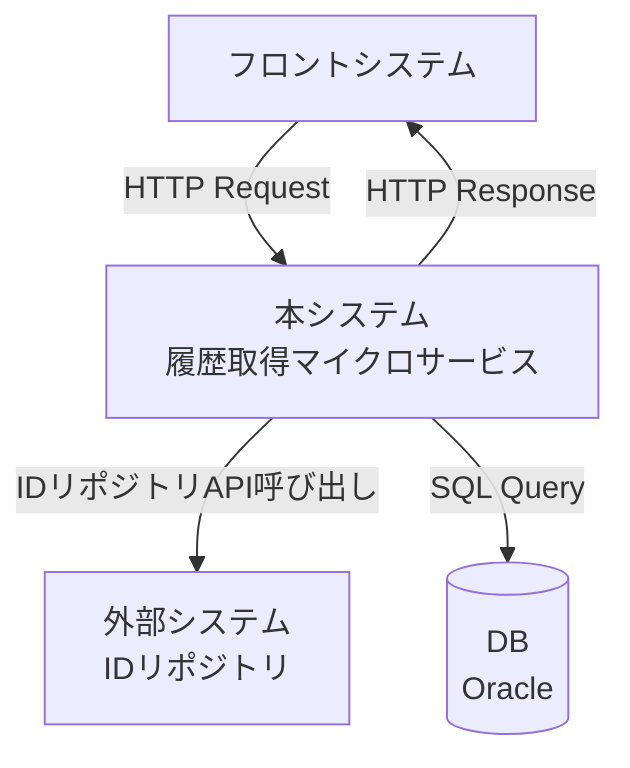
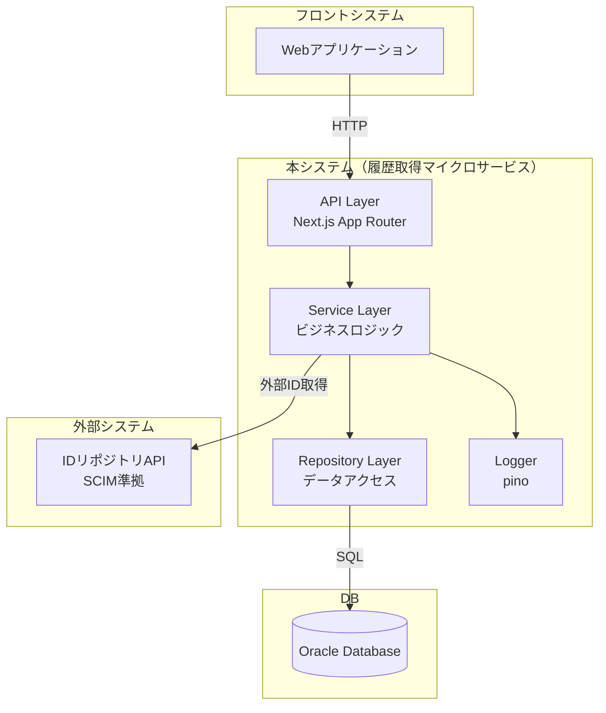
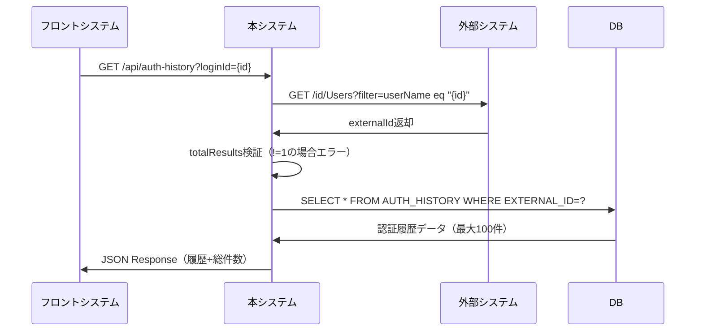
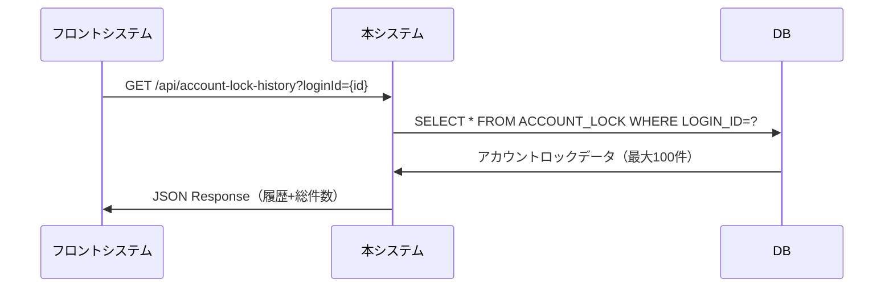
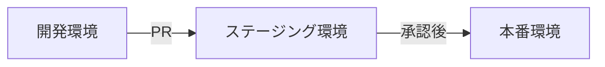
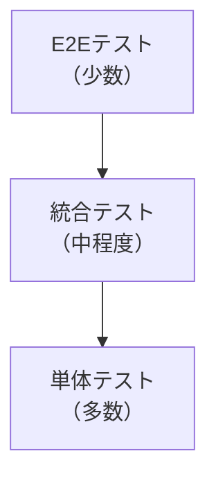
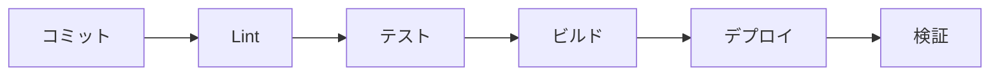

# 基本設計書

## 1. システム概要

### 1.1 システムの目的と概要
履歴情報を返却するマイクロサービス（履歴取得マイクロサービス）を新規作成する。本システムは、認証履歴とアカウントロック履歴をデータベースから取得し、JSON形式でクライアントに返却する。

### 1.2 システム構成図



### 1.3 技術スタックの詳細

| カテゴリ | 技術 | バージョン | 用途 |
|---------|------|-----------|------|
| 言語 | TypeScript | 最新安定版 | 型安全なコード実装 |
| フレームワーク | Next.js | 14.x以降 | サーバーサイドAPI構築 |
| データベース | Oracle | 12c以降 | 履歴データ永続化 |
| DB接続 | oracledb | 最新安定版 | Oracle接続ドライバ |
| ログ | pino | 最新安定版 | 構造化ログ出力 |
| ランタイム | Node.js | 18.x以降 (LTS) | JavaScript実行環境 |

---

## 2. アーキテクチャ設計

### 2.1 システムアーキテクチャ図



### 2.2 コンポーネント構成

```
src/
├── app/
│   └── api/
│       ├── auth-history/
│       │   └── route.ts          # 認証履歴API
│       └── account-lock-history/
│           └── route.ts          # アカウントロック履歴API
├── services/
│   ├── authHistoryService.ts     # 認証履歴ビジネスロジック
│   ├── accountLockService.ts     # アカウントロックビジネスロジック
│   └── idRepositoryService.ts    # IDリポジトリ連携
├── repositories/
│   ├── authHistoryRepository.ts  # 認証履歴データアクセス
│   ├── accountLockRepository.ts  # アカウントロックデータアクセス
│   └── dbConnection.ts           # DB接続管理
├── models/
│   ├── authHistory.ts            # 認証履歴モデル
│   └── accountLock.ts            # アカウントロックモデル
├── utils/
│   ├── logger.ts                 # ログ設定
│   └── errorHandler.ts           # エラーハンドリング
└── config/
    ├── database.ts               # DB設定
    └── idRepository.ts           # IDリポジトリ設定
```

### 2.3 データフロー図

#### 2.3.1 認証履歴取得フロー



#### 2.3.2 アカウントロック履歴取得フロー



---

## 3. API設計

### 3.1 認証履歴返却API

#### 3.1.1 エンドポイント
```
GET /api/auth-history
```

#### 3.1.2 リクエスト仕様

**クエリパラメータ**
| パラメータ名 | 型 | 必須 | 説明 |
|------------|-----|------|------|
| loginId | string | ○ | ログインID |

**リクエスト例**
```
GET /api/auth-history?loginId=user001
```

#### 3.1.3 レスポンス仕様

**成功時（200 OK）**
```json
{
  "totalCount": 150,
  "histories": [
    {
      "loginDate": "2025-10-01T10:30:45.1234",
      "ipAddress": "192.168.1.100",
      "serviceName": "WebPortal"
    },
    {
      "loginDate": "2025-09-30T15:20:30.5678",
      "ipAddress": "192.168.1.101",
      "serviceName": "MobileApp"
    }
  ]
}
```

**レスポンスフィールド**
| フィールド | 型 | 説明 |
|----------|-----|------|
| totalCount | number | 認証履歴の総件数 |
| histories | array | 認証履歴配列（最大100件） |
| histories[].loginDate | string | 認証日時（ISO 8601形式） |
| histories[].ipAddress | string | IPアドレス |
| histories[].serviceName | string | 認証元サービス名 |

#### 3.1.4 エラーレスポンス

**400 Bad Request**
```json
{
  "error": {
    "code": "BAD_REQUEST",
    "message": "loginId is required"
  }
}
```

**500 Internal Server Error**
```json
{
  "error": {
    "code": "MULTIPLE_USERS_FOUND",
    "message": "Multiple users found for the given loginId"
  }
}
```

```json
{
  "error": {
    "code": "INTERNAL_ERROR",
    "message": "An internal error occurred"
  }
}
```

### 3.2 アカウントロック履歴返却API

#### 3.2.1 エンドポイント
```
GET /api/account-lock-history
```

#### 3.2.2 リクエスト仕様

**クエリパラメータ**
| パラメータ名 | 型 | 必須 | 説明 |
|------------|-----|------|------|
| loginId | string | ○ | ログインID |

**リクエスト例**
```
GET /api/account-lock-history?loginId=user001
```

#### 3.2.3 レスポンス仕様

**成功時（200 OK）**
```json
{
  "totalCount": 5,
  "histories": [
    {
      "lockDate": "2025-09-28T14:25:00.0000",
      "ipAddress": "192.168.1.200"
    },
    {
      "lockDate": "2025-08-15T09:10:00.0000",
      "ipAddress": "192.168.1.201"
    }
  ]
}
```

**レスポンスフィールド**
| フィールド | 型 | 説明 |
|----------|-----|------|
| totalCount | number | アカウントロック履歴の総件数 |
| histories | array | アカウントロック履歴配列（最大100件） |
| histories[].lockDate | string | アカウントロック日時（ISO 8601形式） |
| histories[].ipAddress | string | IPアドレス |

#### 3.2.4 エラーレスポンス

**400 Bad Request**
```json
{
  "error": {
    "code": "BAD_REQUEST",
    "message": "loginId is required"
  }
}
```

**500 Internal Server Error**
```json
{
  "error": {
    "code": "INTERNAL_ERROR",
    "message": "An internal error occurred"
  }
}
```

### 3.3 エラーハンドリング

#### 3.3.1 エラーコード一覧

| エラーコード | HTTPステータス | 説明 | 対処方法 |
|------------|--------------|------|---------|
| BAD_REQUEST | 400 | 必須パラメータ不足 | リクエストパラメータを確認 |
| MULTIPLE_USERS_FOUND | 500 | 複数ユーザー検出 | IDリポジトリのデータ整合性確認 |
| ID_REPOSITORY_ERROR | 500 | IDリポジトリAPI呼び出し失敗 | 外部システムの状態確認 |
| DATABASE_ERROR | 500 | データベースエラー | DB接続とクエリを確認 |
| INTERNAL_ERROR | 500 | その他内部エラー | ログを確認して原因特定 |

#### 3.3.2 エラーハンドリングポリシー

1. **バリデーションエラー**: クライアントエラー（400）として返却
2. **外部システムエラー**: サーバーエラー（500）として返却、詳細はログ記録
3. **データベースエラー**: サーバーエラー（500）として返却、詳細はログ記録
4. **予期しないエラー**: 汎用エラーとして返却、スタックトレースをログ記録

### 3.4 認証・認可方式

ローカルネットワークからの利用のため、認証・認可は実装しない。

---

## 4. データベース設計

### 4.1 テーブル設計詳細

#### 4.1.1 認証履歴テーブル（AUTH_HISTORY）

| 列名 | データ型 | NULL許可 | 制約 | 説明 |
|-----|---------|---------|------|------|
| EXTERNAL_ID | VARCHAR2(64) | NOT NULL | PK | 外部ID |
| IP_ADDRESS | VARCHAR2(64) | NOT NULL | - | IPアドレス |
| SERVICE_NAME | VARCHAR2(64) | NOT NULL | - | 認証元サービス名 |
| LOGIN_DATE | TIMESTAMP(4) | NOT NULL | PK | ログイン日時 |
| REG_DATE | DATE | NOT NULL | - | 登録日 |
| REG_NAME | VARCHAR2(64) | NOT NULL | - | 登録者名 |
| ERASE_FLG | VARCHAR2(1) | NOT NULL | CHECK('0','1') | 削除フラグ（0:有効, 1:削除） |

**主キー**: (EXTERNAL_ID, LOGIN_DATE)

#### 4.1.2 アカウントロックテーブル（ACCOUNT_LOCK）

| 列名 | データ型 | NULL許可 | 制約 | 説明 |
|-----|---------|---------|------|------|
| LOGIN_ID | VARCHAR2(64) | NOT NULL | PK | ログインID |
| IP_ADDRESS | VARCHAR2(15) | NOT NULL | - | IPアドレス |
| LOCK_DATE | DATE | NOT NULL | PK | ロック日時 |
| LOCK_FLG | VARCHAR2(1) | NOT NULL | CHECK('0','1') | ロックフラグ（0:解除, 1:ロック） |
| REG_DATE | DATE | NOT NULL | - | 登録日 |
| REG_NAME | VARCHAR2(64) | NOT NULL | - | 登録者名 |
| ERASE_FLG | VARCHAR2(1) | NOT NULL | CHECK('0','1') | 削除フラグ（0:有効, 1:削除） |

**主キー**: (LOGIN_ID, LOCK_DATE)

### 4.2 インデックス設計

#### 4.2.1 認証履歴テーブル

```sql
-- 主キーインデックス（自動作成）
-- PK_AUTH_HISTORY on (EXTERNAL_ID, LOGIN_DATE)

-- 検索用インデックス
CREATE INDEX IDX_AUTH_HISTORY_EXTERNAL_ID 
ON AUTH_HISTORY(EXTERNAL_ID, LOGIN_DATE DESC, ERASE_FLG);
```

**インデックス設計理由**:
- EXTERNAL_IDで検索し、LOGIN_DATEの降順でソートするクエリに最適化
- ERASE_FLGを含めることで、削除済みレコードの除外を高速化

#### 4.2.2 アカウントロックテーブル

```sql
-- 主キーインデックス（自動作成）
-- PK_ACCOUNT_LOCK on (LOGIN_ID, LOCK_DATE)

-- 検索用インデックス
CREATE INDEX IDX_ACCOUNT_LOCK_LOGIN_ID 
ON ACCOUNT_LOCK(LOGIN_ID, LOCK_DATE DESC, ERASE_FLG);
```

**インデックス設計理由**:
- LOGIN_IDで検索し、LOCK_DATEの降順でソートするクエリに最適化
- ERASE_FLGを含めることで、削除済みレコードの除外を高速化

### 4.3 データアクセスパターン

#### 4.3.1 認証履歴取得クエリ

```sql
SELECT 
    LOGIN_DATE,
    IP_ADDRESS,
    SERVICE_NAME
FROM AUTH_HISTORY
WHERE EXTERNAL_ID = :externalId
  AND ERASE_FLG = '0'
ORDER BY LOGIN_DATE DESC
FETCH FIRST 100 ROWS ONLY;
```

**総件数取得クエリ**:
```sql
SELECT COUNT(*) as TOTAL_COUNT
FROM AUTH_HISTORY
WHERE EXTERNAL_ID = :externalId
  AND ERASE_FLG = '0';
```

#### 4.3.2 アカウントロック履歴取得クエリ

```sql
SELECT 
    LOCK_DATE,
    IP_ADDRESS
FROM ACCOUNT_LOCK
WHERE LOGIN_ID = :loginId
  AND ERASE_FLG = '0'
ORDER BY LOCK_DATE DESC
FETCH FIRST 100 ROWS ONLY;
```

**総件数取得クエリ**:
```sql
SELECT COUNT(*) as TOTAL_COUNT
FROM ACCOUNT_LOCK
WHERE LOGIN_ID = :loginId
  AND ERASE_FLG = '0';
```

### 4.4 パフォーマンス考慮事項

#### 4.4.1 クエリ最適化
- `FETCH FIRST n ROWS ONLY`を使用して100件制限を実装
- インデックスを活用してソート処理を最適化
- ERASE_FLGによるフィルタリングをインデックスに含める

#### 4.4.2 接続プーリング
```typescript
// 接続プール設定例
{
  user: process.env.DB_USER,
  password: process.env.DB_PASSWORD,
  connectString: process.env.DB_CONNECT_STRING,
  poolMin: 2,
  poolMax: 10,
  poolIncrement: 1,
  poolTimeout: 60,
  enableStatistics: true
}
```

#### 4.4.3 クエリキャッシュ
- 頻繁にアクセスされるデータは適切なキャッシュ戦略を検討
- ただし、履歴データは準リアルタイム性が求められるため、基本的にはキャッシュなし

#### 4.4.4 パーティショニング（将来の拡張）
データ量が増加した場合の対策:
- 日付ベースのレンジパーティショニングを検討
- 古いデータのアーカイブ戦略

---

## 5. セキュリティ設計

### 5.1 セキュリティ要件の実装方法

ローカルネットワークからの利用のため、以下のセキュリティ対策は最小限とする。

### 5.2 データ保護方針

#### 5.2.1 データベース接続情報
- 環境変数による接続情報の管理
- `.env`ファイルは`.gitignore`に追加
- 本番環境では環境変数またはシークレット管理サービスを使用

```typescript
// 環境変数の例
DB_USER=history_service_user
DB_PASSWORD=secure_password
DB_CONNECT_STRING=localhost:1521/ORCL
ID_REPOSITORY_URL=http://localhost:4000
```

#### 5.2.2 ログ出力
- 個人情報（ログインID、IPアドレス等）はログレベルに応じてマスキング
- スタックトレースに機密情報を含めない

```typescript
// ログマスキング例
logger.info({
  loginId: maskSensitiveData(loginId),
  action: 'fetch_auth_history'
});
```

### 5.3 アクセス制御

#### 5.3.1 ネットワークレベル
- ローカルネットワークからのアクセスのみ許可
- ファイアウォールでポートを制限

#### 5.3.2 アプリケーションレベル
- 入力値のバリデーション（SQLインジェクション対策）
- バインド変数の使用
- パラメータの型チェック

```typescript
// バインド変数の使用例
const result = await connection.execute(
  'SELECT * FROM AUTH_HISTORY WHERE EXTERNAL_ID = :externalId',
  { externalId: sanitizedExternalId }, // バインド変数
  { outFormat: oracledb.OUT_FORMAT_OBJECT }
);
```

### 5.4 その他のセキュリティ対策

#### 5.4.1 エラーメッセージ
- クライアントに詳細なエラー情報を返さない
- エラーの詳細はサーバーログにのみ記録

#### 5.4.2 依存パッケージ
- 定期的な依存パッケージの更新
- `npm audit`による脆弱性チェック

---

## 6. 非機能要件

### 6.1 パフォーマンス要件

| 項目 | 目標値 | 測定方法 |
|-----|-------|---------|
| レスポンスタイム（95パーセンタイル） | 1秒以内 | APMツールまたはログ分析 |
| スループット | 100リクエスト/秒 | 負荷テストツール |
| 同時接続数 | 50接続 | 接続プール設定 |

#### 6.1.1 パフォーマンス最適化戦略
1. **データベース最適化**
   - 適切なインデックス設計
   - FETCH FIRST句による件数制限
   - 接続プーリング

2. **アプリケーション最適化**
   - 非同期処理の活用
   - 不要なデータ取得の削減
   - 効率的なJSON変換

3. **ネットワーク最適化**
   - レスポンスのgzip圧縮
   - 適切なHTTPヘッダー設定

### 6.2 可用性要件

| 項目 | 目標値 | 実装方法 |
|-----|-------|---------|
| 稼働率 | 99.0% | ヘルスチェック、自動再起動 |
| 復旧時間目標（RTO） | 10分以内 | 自動デプロイメント |
| 復旧ポイント目標（RPO） | データ損失なし | 既存DBのバックアップ戦略に従う |

#### 6.2.1 可用性向上策
1. **ヘルスチェックエンドポイント**
   ```typescript
   // GET /api/health
   {
     "status": "healthy",
     "database": "connected",
     "timestamp": "2025-10-01T10:00:00Z"
   }
   ```

2. **グレースフルシャットダウン**
   - SIGTERMシグナルハンドリング
   - 処理中のリクエスト完了を待機
   - DB接続の適切なクローズ

3. **エラーリカバリ**
   - DB接続エラー時の自動リトライ
   - タイムアウト設定

### 6.3 スケーラビリティ要件

#### 6.3.1 垂直スケーリング
- CPU: 2コア以上
- メモリ: 4GB以上
- 必要に応じてスペックアップ

#### 6.3.2 水平スケーリング
- ステートレス設計により複数インスタンス展開可能
- ロードバランサーによる負荷分散（将来の拡張）

#### 6.3.3 データベーススケーリング
- 既存のOracleデータベースのスケーリング戦略に従う
- リードレプリカの活用（将来の拡張）

### 6.4 監視・ログ要件

#### 6.4.1 ログレベル

| レベル | 用途 | 出力内容例 |
|-------|------|----------|
| ERROR | エラー発生時 | スタックトレース、エラーコンテキスト |
| WARN | 警告事項 | 性能劣化、外部システムリトライ |
| INFO | 通常の処理フロー | API呼び出し、処理完了 |
| DEBUG | デバッグ情報 | SQLクエリ、パラメータ値 |

#### 6.4.2 ログ出力項目

```json
{
  "timestamp": "2025-10-01T10:00:00.000Z",
  "level": "info",
  "requestId": "uuid-v4",
  "api": "/api/auth-history",
  "method": "GET",
  "statusCode": 200,
  "responseTime": 250,
  "loginId": "masked-user-id",
  "message": "Auth history fetched successfully"
}
```

#### 6.4.3 監視項目

| 監視項目 | 閾値 | アクション |
|---------|------|----------|
| レスポンスタイム | 95%ile > 1秒 | パフォーマンス調査 |
| エラー率 | > 5% | エラーログ確認、アラート |
| CPU使用率 | > 80% | スケーリング検討 |
| メモリ使用率 | > 85% | メモリリーク調査 |
| DB接続プール枯渇 | 利用率 > 90% | プール設定見直し |

---

## 7. 運用設計

### 7.1 デプロイメント設計

#### 7.1.1 デプロイメント構成



#### 7.1.2 環境別設定

| 環境 | Node.js | ログレベル | DB接続プール | 用途 |
|-----|---------|----------|------------|------|
| 開発 | 18.x LTS | DEBUG | min:1, max:3 | ローカル開発 |
| ステージング | 18.x LTS | INFO | min:2, max:5 | 結合テスト |
| 本番 | 18.x LTS | INFO | min:2, max:10 | 本番運用 |

#### 7.1.3 デプロイメント手順

1. **ビルド**
   ```bash
   npm run build
   ```

2. **環境変数設定**
   ```bash
   # .env.production
   NODE_ENV=production
   DB_USER=prod_user
   DB_PASSWORD=***
   DB_CONNECT_STRING=prod-db:1521/PROD
   ID_REPOSITORY_URL=http://id-repo.internal:4000
   LOG_LEVEL=info
   ```

3. **アプリケーション起動**
   ```bash
   npm run start
   ```

4. **ヘルスチェック**
   ```bash
   curl http://localhost:3000/api/health
   ```

#### 7.1.4 ロールバック手順

1. 前バージョンのDockerイメージまたはソースコードに切り替え
2. アプリケーション再起動
3. ヘルスチェック確認

### 7.2 監視・アラート設計

#### 7.2.1 監視ツール
- **ログ監視**: pino-prettyまたはログ集約ツール（Splunk、ELK Stack等）
- **メトリクス監視**: Node.js標準メトリクス（CPU、メモリ、イベントループ）
- **APM**: New Relic、Datadog等（オプション）

#### 7.2.2 アラート設定

| アラート | 条件 | 優先度 | 通知先 |
|---------|------|-------|-------|
| サービスダウン | ヘルスチェック失敗（3回連続） | 高 | 運用チーム |
| エラー率上昇 | エラー率 > 5%（5分間） | 中 | 開発チーム |
| 性能劣化 | レスポンスタイム > 2秒（95%ile） | 中 | 開発チーム |
| DB接続エラー | DB接続失敗 | 高 | 運用チーム、DBチーム |

### 7.3 バックアップ・復旧設計

#### 7.3.1 データベースバックアップ
- 既存のOracleデータベースのバックアップ戦略に従う
- 本マイクロサービスは既存データを読み取るのみ（データ更新なし）

#### 7.3.2 アプリケーションバックアップ
- ソースコード: Gitリポジトリで管理
- 設定ファイル: バージョン管理システムで管理
- Dockerイメージ: コンテナレジストリで管理（Docker使用時）

#### 7.3.3 災害復旧計画

| 障害シナリオ | 復旧手順 | RTO |
|-----------|---------|-----|
| アプリケーション異常終了 | 自動再起動 | 1分 |
| デプロイ失敗 | 前バージョンへロールバック | 5分 |
| DB接続不可 | DB復旧待機、リトライ | DB復旧次第 |

### 7.4 ログ管理設計

#### 7.4.1 ログファイル設計

```
logs/
├── application.log       # アプリケーションログ
├── error.log            # エラーログ
└── access.log           # アクセスログ
```

#### 7.4.2 ログローテーション
- **サイズベース**: 100MB/ファイル
- **期間ベース**: 日次
- **保持期間**: 30日
- **圧縮**: gzip

#### 7.4.3 ログ転送
- リアルタイムログ転送をログ集約サービスへ（オプション）
- syslog、fluentd等の活用

---

## 8. 開発・テスト設計

### 8.1 開発環境構築

#### 8.1.1 必要なツール

| ツール | バージョン | 用途 |
|-------|-----------|------|
| Node.js | 18.x LTS | ランタイム |
| npm | 9.x以降 | パッケージ管理 |
| TypeScript | 5.x | 開発言語 |
| Oracle Instant Client | 21.x | ローカルDB接続 |
| Docker | 最新 | コンテナ化（オプション） |

#### 8.1.2 セットアップ手順

```bash
# 1. リポジトリクローン
git clone <repository-url>
cd history-service

# 2. 依存パッケージインストール
npm install

# 3. 環境変数設定
cp .env.example .env
# .envファイルを編集してDB接続情報を設定

# 4. 開発サーバー起動
npm run dev
```

#### 8.1.3 開発環境用Docker Compose（オプション）

```yaml
version: '3.8'
services:
  app:
    build: .
    ports:
      - "3000:3000"
    environment:
      - NODE_ENV=development
      - DB_USER=${DB_USER}
      - DB_PASSWORD=${DB_PASSWORD}
      - DB_CONNECT_STRING=oracle:1521/ORCLPDB1
    depends_on:
      - oracle
  
  oracle:
    image: container-registry.oracle.com/database/express:21.3.0-xe
    ports:
      - "1521:1521"
    environment:
      - ORACLE_PWD=password
```

### 8.2 テスト戦略

#### 8.2.1 テストピラミッド



#### 8.2.2 テストレベル

| テストレベル | 対象 | ツール | カバレッジ目標 |
|-----------|------|-------|-------------|
| 単体テスト | 各関数、メソッド | Jest | 80%以上 |
| 統合テスト | API、DB連携 | Jest + Supertest | 主要パス100% |
| E2Eテスト | 全体フロー | Jest + Supertest | 主要シナリオ |

#### 8.2.3 テストケース設計

**単体テスト**
```typescript
// services/authHistoryService.test.ts
describe('AuthHistoryService', () => {
  describe('getAuthHistory', () => {
    it('should return auth history for valid loginId', async () => {
      // Arrange
      const loginId = 'user001';
      const mockExternalId = 'ext123';
      
      // Act
      const result = await authHistoryService.getAuthHistory(loginId);
      
      // Assert
      expect(result.totalCount).toBeGreaterThan(0);
      expect(result.histories).toHaveLength(100);
    });
    
    it('should throw error when multiple users found', async () => {
      // Arrange
      const loginId = 'duplicate-user';
      
      // Act & Assert
      await expect(
        authHistoryService.getAuthHistory(loginId)
      ).rejects.toThrow('Multiple users found');
    });
  });
});
```

**統合テスト**
```typescript
// api/auth-history/route.test.ts
describe('GET /api/auth-history', () => {
  it('should return 200 and auth history', async () => {
    const response = await request(app)
      .get('/api/auth-history')
      .query({ loginId: 'user001' });
    
    expect(response.status).toBe(200);
    expect(response.body).toHaveProperty('totalCount');
    expect(response.body).toHaveProperty('histories');
  });
  
  it('should return 400 when loginId is missing', async () => {
    const response = await request(app)
      .get('/api/auth-history');
    
    expect(response.status).toBe(400);
    expect(response.body.error.code).toBe('BAD_REQUEST');
  });
});
```

### 8.3 CI/CDパイプライン

#### 8.3.1 CI/CDフロー



#### 8.3.2 GitHub Actions設定例

```yaml
name: CI/CD Pipeline

on:
  push:
    branches: [main, develop]
  pull_request:
    branches: [main, develop]

jobs:
  test:
    runs-on: ubuntu-latest
    steps:
      - uses: actions/checkout@v3
      - uses: actions/setup-node@v3
        with:
          node-version: '18'
      - run: npm ci
      - run: npm run lint
      - run: npm run test
      - run: npm run build
  
  deploy:
    needs: test
    runs-on: ubuntu-latest
    if: github.ref == 'refs/heads/main'
    steps:
      - uses: actions/checkout@v3
      - name: Deploy to production
        run: |
          # デプロイスクリプト実行
          ./deploy.sh
```

#### 8.3.3 パイプラインステージ

| ステージ | 処理内容 | 失敗時の対応 |
|---------|---------|-----------|
| Lint | ESLint、Prettier | エラー表示、コミット拒否 |
| Unit Test | 単体テスト実行 | パイプライン停止 |
| Integration Test | 統合テスト実行 | パイプライン停止 |
| Build | TypeScriptコンパイル | パイプライン停止 |
| Security Scan | npm audit | 警告表示（継続可） |
| Deploy | アプリケーションデプロイ | ロールバック |

### 8.4 コード品質管理

#### 8.4.1 静的解析ツール

```json
// package.json
{
  "scripts": {
    "lint": "eslint . --ext .ts,.tsx",
    "format": "prettier --write .",
    "type-check": "tsc --noEmit"
  },
  "devDependencies": {
    "eslint": "^8.0.0",
    "prettier": "^3.0.0",
    "typescript": "^5.0.0"
  }
}
```

#### 8.4.2 コーディング規約
- **スタイル**: Prettier設定に従う
- **命名規則**: 
  - ファイル: camelCase.ts
  - クラス: PascalCase
  - 関数・変数: camelCase
  - 定数: UPPER_SNAKE_CASE
- **TypeScript**: strict mode有効化

#### 8.4.3 コードレビュー基準
- [ ] 仕様に準拠しているか
- [ ] テストが適切に書かれているか
- [ ] エラーハンドリングが適切か
- [ ] ログ出力が適切か
- [ ] パフォーマンスに問題がないか
- [ ] セキュリティに問題がないか

---

## 9. 付録

### 9.1 用語集

| 用語 | 説明 |
|-----|------|
| IDリポジトリ | ユーザーIDを管理する外部システム（SCIM準拠） |
| 外部ID | IDリポジトリで管理される一意の識別子 |
| ログインID | ユーザーがログイン時に使用するID |
| マイクロサービス | 単一の責務を持つ独立したサービス |

### 9.2 参考資料

- [Next.js Documentation](https://nextjs.org/docs)
- [Oracle Database Node.js Driver](https://node-oracledb.readthedocs.io/)
- [Pino Logger](https://getpino.io/)
- [SCIM Protocol](https://datatracker.ietf.org/doc/html/rfc7644)

### 9.3 変更履歴

| 日付 | バージョン | 変更内容 | 作成者 |
|-----|-----------|---------|-------|
| 2025-10-01 | 1.0 | 初版作成 | - |

---

**文書作成日**: 2025年10月1日  
**承認者**: -  
**次回レビュー予定日**: -

